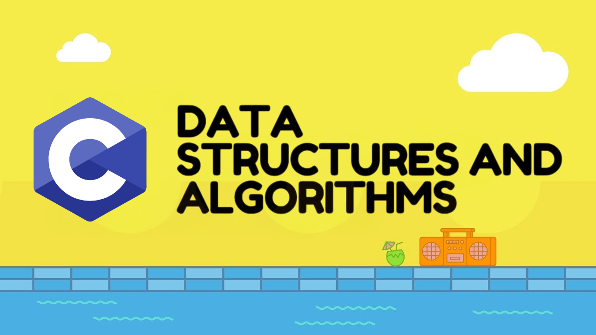

# DSAinC



This repository is dedicated to practicing data structures and algorithms in C.

## Table of Contents

- [Introduction](#introduction)
- [Getting Started](#getting-started)
- [Data Structures](#data-structures)
- [Algorithms](#algorithms)
- [Contributing](#contributing)
- [License](#license)

## Introduction

Welcome to the DSAinC repository! This project aims to provide a comprehensive collection of data structures and algorithms implemented in the C programming language. It is designed for students, educators, and professionals who want to improve their understanding and skills in DSA.

## Getting Started

To get started with this repository, clone it to your local machine using the following command:

```sh
git clone https://github.com/shanelperera-exe/DSAinC.git
```

Navigate to the project directory:

```sh
cd DSAinC
```

## Data Structures

The repository includes implementations of various data structures such as:

- Arrays
- Linked Lists
- Stacks
- Queues
- Trees
- Graphs
- Hash Tables

## Algorithms

You will also find implementations of common algorithms, including but not limited to:

- Sorting Algorithms (Bubble Sort, Merge Sort, Quick Sort, etc.)
- Searching Algorithms (Linear Search, Binary Search, etc.)
- Graph Algorithms (DFS, BFS, Dijkstra's Algorithm, etc.)
- Dynamic Programming

## Contributing

Contributions are welcome! If you have any improvements or new implementations to add, please fork the repository and create a pull request. Make sure to follow the coding standards and include appropriate comments and documentation.

## License

This project is licensed under the MIT License. See the [LICENSE](LICENSE) file for more details.

**Resources:**

- [GeeksforGeeks - Learn DSA in C](https://www.geeksforgeeks.org/learn-dsa-in-c/)